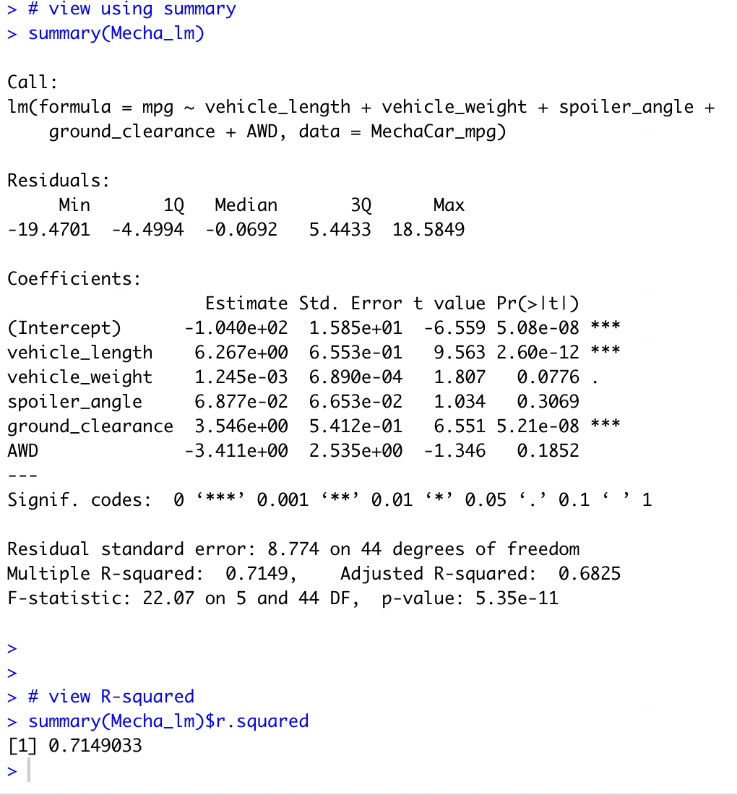
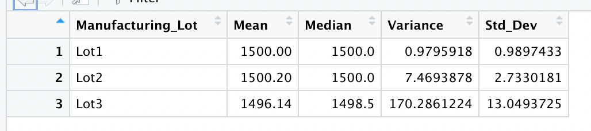
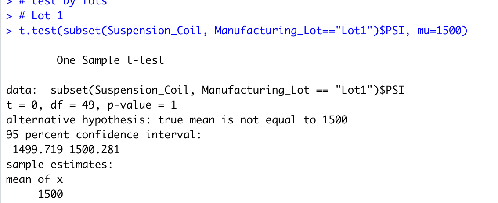
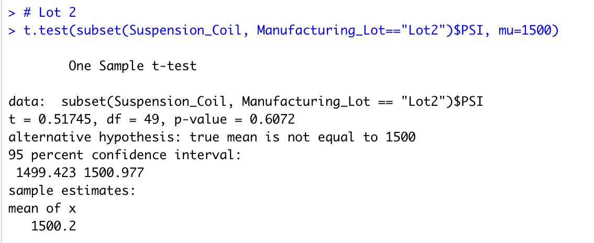
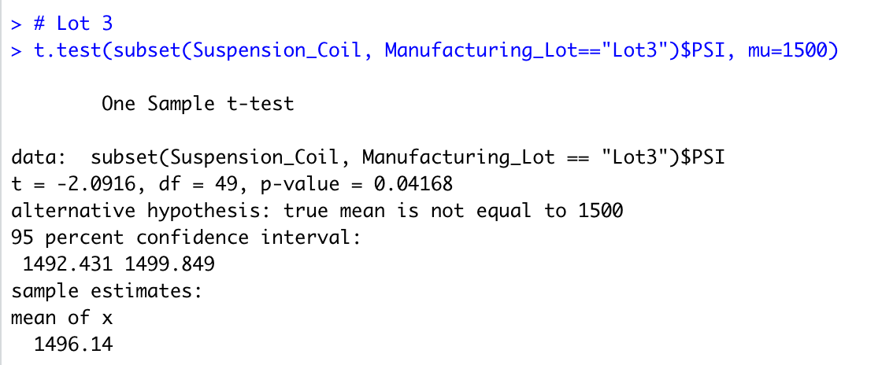

# MechaCar_Statistical_Analysis

## Linear Regression to Predict MPG
Uses multiple linear regression to properly analyze which variables in the given dataset will accurately predict a model's MPG.

* Q1. Which variables/coefficients provided a non-random amount of variance to the mpg values in the dataset?
  - A1. Using the given MechaCar_mpg dataset to determine the statistical variance in vehicle_weight and ground_clearance make it unlikely to be inefficent in accurately assessing MPG.

* Q2. Is the slope of the linear model considered to be zero? Why or why not?
  - A2. The slope is statistcally significant in that the intercept is less than .05 and greater than 0. The intercept shows variability in the dependent variable, while the independent varaibles are all amounting to zero.

* Q3. Does this linear model predict mpg of MechaCar prototypes effectively? Why or why not?
  - A3. The Multiple R-Squared value is equal to 0.7149033 or 0.7149. As this value is between 0 and 1, it can be used to indicate that the model is efficient in predicting MPG.

## Summary Statistics on Suspension Coils

* Q1. The design specifications for the MechaCar suspension coils dictate that the variance of the suspension coils must not exceed 100 pounds per square inch. Does the current manufacturing data meet this design specification for all manufacturing lots in total and each lot individually? Why or why not?
  - A1. By analyzing all three Lots together, the total variance is 62.29356, under the 100 pounds per square inch.
  - A2. By analyzing the three Lots separately, Lots 1 and 2 both meet the criteria of fallung under 100 pounds per square inch, while Lot 3 exceeds it.

## Lot Summary

* Lot 1 is not significantly different from the mean.

* Lot 2 is not significantly different from the mean.

* Lot 3 is significantly different from the mean.

## Study Design: MechaCar vs Competition

A statistical study that could be performed against competitors is the safety averages for passengers, specifically female passengers as most model tests are done with test dummies that are sized and weighted as the average male, resulting in different saftey rates.
* It might be best to use a Two-Sample t-Test to determine the variance in safety ratings, using data from male-dummy and female-dummy saftey tests, using dichotomous data (Sample A or male dummies and Sample B or female dummies).
* The alternative hypothesis could be that the findings of the safety tests are less than .05, making the signifcance of the results inconsequential.
